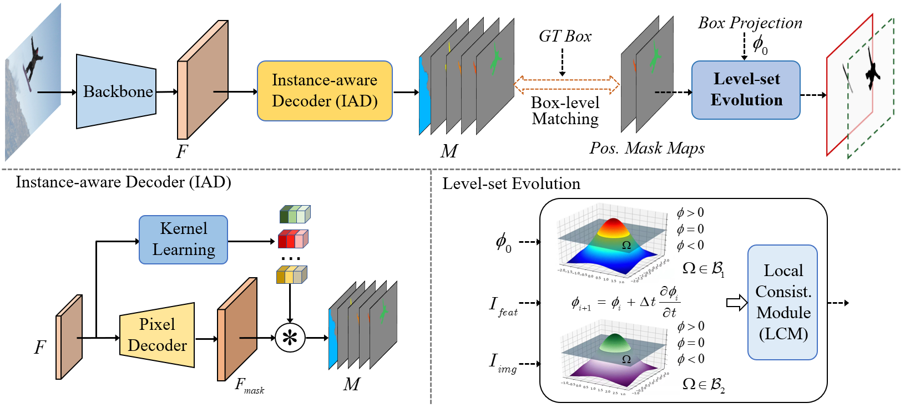

[](https://paperswithcode.com/sota/box-supervised-instance-segmentation-on-coco?p=box2mask-box-supervised-instance-segmentation)
 	[](https://paperswithcode.com/sota/box-supervised-instance-segmentation-on?p=box2mask-box-supervised-instance-segmentation)

## Box2Mask: Box-supervised Instance Segmentation via Level-set Evolution 
> Wentong Li, Wenyu Liu, [Jianke Zhu](https://person.zju.edu.cn/jkzhu), Miaomiao Cui, Risheng Yu, [Xiansheng Hua](https://scholar.google.com.hk/citations?user=6G-l4o0AAAAJ&hl=zh-CN&oi=ao) and [Lei Zhang](https://www4.comp.polyu.edu.hk/~cslzhang/)

**[Paper](https://arxiv.org/pdf/2212.01579.pdf) (arXiv).**

**_This version is the extension of [BoxLevelSet](https://link.springer.com/chapter/10.1007/978-3-031-19818-2_1) (eccv2022) with Transformer-based framework with the powerfully performance._**

 

**_The codes and pretrained models for Box2Mask are under preparation._**

**_We develop a toolbox-[BoxInstSeg](https://github.com/LiWentomng/BoxInstSeg) for box-supervised instance segmentation. More codes and methods (e.g. BoxInst, DiscoBox, Box2Mask) will be updated in it._**

## 

 > Visual performance on COCO of Box2Mask-T.
 

   

## Installation

This implementation is based on [MMdetection](https://github.com/open-mmlab/mmdetection).
Please refer to [install.md](./docs/install.md) for detailed installation.


## Getting Started 
Please see [getting_started.md](./docs/get_started.md) for models `training` and `inference`.

## Performance of  models 
### Models (ECCV2022 version)
 * The following models are trained with Telsa V100 GPU. 
 * The pretrained models are in GoogleDriver.

#### Mask AP Results on Pascal VOC val
|     Backbone    |  schd | Models | GPUs | AP  | AP_25 | AP_50 | AP_70 | AP_75 | 
|:---------------:|--------|--------|:----:|:----:|:-----:|:-----:|:--------:|:---------:|
|    ResNet-50    |   3x   |[model](https://drive.google.com/file/d/1Yl4QCRx_VKY_OvEI6sz36BI88sSOWWhu/view?usp=sharing) |  4 |36.5 |  76.8 |  64.2 |   44.8   |    36.4   |  
|   ResNet-101    |   3x   |[model](https://drive.google.com/file/d/1gMWGxmPyHFyxR0re3lHbMjxl3xvPvWeh/view?usp=sharing) |  4 |38.3 |  77.9 |  66.3 |   46.4   |    38.7   | 


#### Mask AP Results on COCO 2017
|     Backbone    |  schd  |Models | GPUs | AP(val)  | AP(test-dev) |
|:---------------:|--------|--------|:----:|:----:|:-----:|
|    ResNet-50    |  3x    |[model](https://drive.google.com/file/d/1R-2s5wh-Rj82yieFcXa5_T9gW9oB29dj/view?usp=sharing)  |  8  |31.4 |  31.7 | 
|   ResNet-101    |  3x    |[model](https://drive.google.com/file/d/1mZ5PBRINlfhHPxzSPvace65Qs4lzG2kL/view?usp=sharing)  |  8  |33.0 |  33.4 | 
|   ResNet-101-DCN|  3x    |[model](https://drive.google.com/file/d/1aZN9CUd2flcsW_KewWUgerjF0AjWszCB/view?usp=sharing)  |  8  |35.0 |  35.4 | 
 
 Note: 
 * Following [BBTP](https://github.com/chengchunhsu/WSIS_BBTP) and [DiscoBox](https://github.com/NVlabs/DiscoBox), the Pascal VOC is aumented Pascal VOC([data link](https://drive.google.com/file/d/16Mz13NSZBbhwPuRxiwi7ZA2Qvt9DaKtN/view?usp=sharing)) with SBD. We recomment the users to train the Pascal VOC first to validate the performance with  ~14 hours training time. 
 * Training COCO with 3x needs about 4 days. 


## Citation
```BibTeX
@article{li2022box2mask,
  title={Box2Mask: Box-supervised Instance Segmentation via Level Set Evolution},
  author={Wentong Li, Wenyu Liu, Jianke Zhu,  Miaomiao Cui, Risheng Yu, Xiansheng Hua and Lei Zhang},
  journal={arXiv},
  year={2022}
}
```

```BibTeX
@inproceedings{li2022box,
  title={Box-supervised Instance Segmentation with Level Set Evolution},
  author={Wentong Li, Wenyu Liu, Jianke Zhu,  Miaomiao Cui,  Xiansheng Hua and Lei Zhang},
  booktitle={European Conference on Computer Vision},
  pages={1--18},
  year={2022}
}
```


##  Acknowledgements

[SOLO](https://github.com/WXinlong/SOLO)

[AdelaiDet](https://github.com/aim-uofa/AdelaiDet)


### License

This project is licensed under the Apache License 2.0. 

