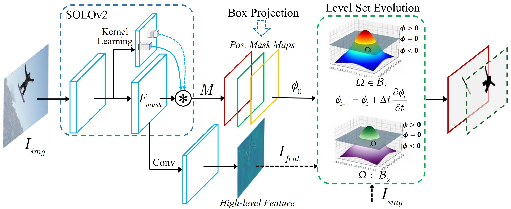

## Box-supervised Instance Segmentation via Level Set Evolution 
> [Wentong Li](https://cslwt.github.io/), Wenyu Liu, [Jianke Zhu](https://person.zju.edu.cn/jkzhu), Miaomiao Cui, [Xiansheng Hua](https://scholar.google.com.hk/citations?user=6G-l4o0AAAAJ&hl=zh-CN&oi=ao) and [Lei Zhang](https://www4.comp.polyu.edu.hk/~cslzhang/)  
**[Paper](https://arxiv.org/pdf/2207.09055.pdf) (arXiv).**
> **ECCV2022.**



## _News_

- Inspired by our boxlevelset, [BoxSnake](https://github.com/Yangr116/BoxSnake) is developed. Please see the paper for the details.
  
- We develop **[BoxInstSeg](https://github.com/LiWentomng/BoxInstSeg)**, which is a toolbox for box-supervised instance segmentation. More methods (e.g. BoxInst, DiscoBox, Box2Mask) are updated in it.

- We extend our work to [Box2Mask](https://arxiv.org/pdf/2212.01579.pdf) to obtain the powerful performance, which build our method on CNN-based (Box2Mask-C) and Transformer-based (Box2Mask-T) frameworks. Please see our [paper](https://arxiv.org/pdf/2212.01579.pdf) (arXiv) for details.  **_The codes and pretrained models for Box2Mask are released in [BoxInstSeg](https://github.com/LiWentomng/BoxInstSeg)._**


## 

 > Visual performance on COCO of our Transformer-based method(Box2Mask-T).
 

   
## Model Zoo
- This code is for our eccv version paper. The pretrained models are in [model_zoo](https://github.com/LiWentomng/boxlevelset/blob/main/docs/model_zoo.md).

- The codes and pretrained models for *Box2Mask* are availble in [BoxInstSeg](https://github.com/LiWentomng/BoxInstSeg).

## Installation

This implementation is based on [MMdetection](https://github.com/open-mmlab/mmdetection).
Please refer to [install.md](./docs/install.md) for detailed installation.


## Getting Started 
Please see [getting_started.md](./docs/get_started.md) for models `training` and `inference`.


## Citation


```BibTeX
@inproceedings{li2022box,
  title={Box-supervised Instance Segmentation with Level Set Evolution},
  author={Wentong Li, Wenyu Liu, Jianke Zhu,  Miaomiao Cui,  Xiansheng Hua and Lei Zhang},
  booktitle={European Conference on Computer Vision},
  pages={1--18},
  year={2022}
}
```

```BibTeX
@article{li2022box2mask,
  title={Box2Mask: Box-supervised Instance Segmentation via Level Set Evolution},
  author={Wentong Li, Wenyu Liu, Jianke Zhu,  Miaomiao Cui, Risheng Yu, Xiansheng Hua and Lei Zhang},
  journal={arXiv},
  year={2022}
}
```

## More
**This **[repo](https://github.com/LiWentomng/Box-supervised-instance-segmentation)** will update the **survey** of _box-supervised instance segmentation._**


### License

This project is licensed under the Apache License 2.0. 

